# AlgoWiki — 게임화한 알고리즘 온라인 저지

  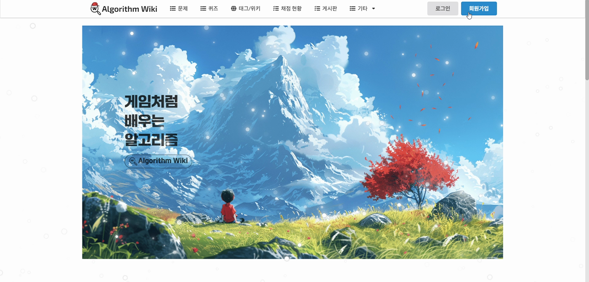

> 협성대학교 소프트웨어학과 **졸업작품**으로 팀과 함께 개발·운영한 알고리즘 온라인 저지(OJ)입니다.
> 오픈소스 [hustoj](https://github.com/zhblue/hustoj)를 기반으로, 저는 **백엔드·인프라**와 함께
> 그 위에 **RPG형 게임화 레이어(퀘스트 · 재화 · 상점 · 인벤토리 · 복권 · 칭호)의 백엔드**를
> 설계·구현했습니다. 또한 사이트 내 모든 문제(약 217개)를 직접 출제했습니다.

이 저장소는 **프로젝트 개요·아키텍처**와 함께, **게임화 백엔드 소스**([`source/`](source/))를 정리한 것입니다.
제가 직접 출제한 문제들은 별도 아카이브로 정리해 두었습니다 → **[algowiki-problems](https://github.com/pill27211/algowiki-problems)** ([웹](https://pill27211.github.io/algowiki-problems/))

---

## 1. 프로젝트 개요

| | |
|---|---|
| **무엇** | 알고리즘 문제 풀이 온라인 저지 (제출 → 자동 채점 → 랭킹) |
| **차별점** | 단순 채점기를 넘어, **문제 풀이에 RPG식 성장·경제 시스템을 결합** |
| **기간 / 형태** | 2024, 협성대 소프트웨어학과 팀 졸업작품 · 실서비스 운영 |
| **베이스** | hustoj (오픈소스 OJ, C/C++ 채점 데몬 + PHP 웹) |
| **제 역할** | 백엔드·인프라 전반 + **게임화 시스템 백엔드 설계·구현**, 문제 전량 출제 |

> "왜 게임화인가" — 알고리즘 학습은 진입장벽이 높고 중도 이탈이 큽니다.
> 매일의 퀘스트·재화·상점·수집 요소로 **꾸준한 문제 풀이 동기**를 만드는 것이 목표였습니다.

## 2. 게임화 백엔드

hustoj의 채점/문제/유저 도메인 위에, 아래 시스템을 **데이터 모델부터 배치 로직까지** 새로 얹었습니다.

### 재화 & 성장
- **코인(coin)** 과 **경험치(exp)** 이원 재화. 퀘스트·문제 해결로 획득 (`quests.quest_comp_coin`, `quest_comp_exp`).
- 코인은 상점 소비, 경험치는 **레벨·등급(고수 등)** 성장에 사용.

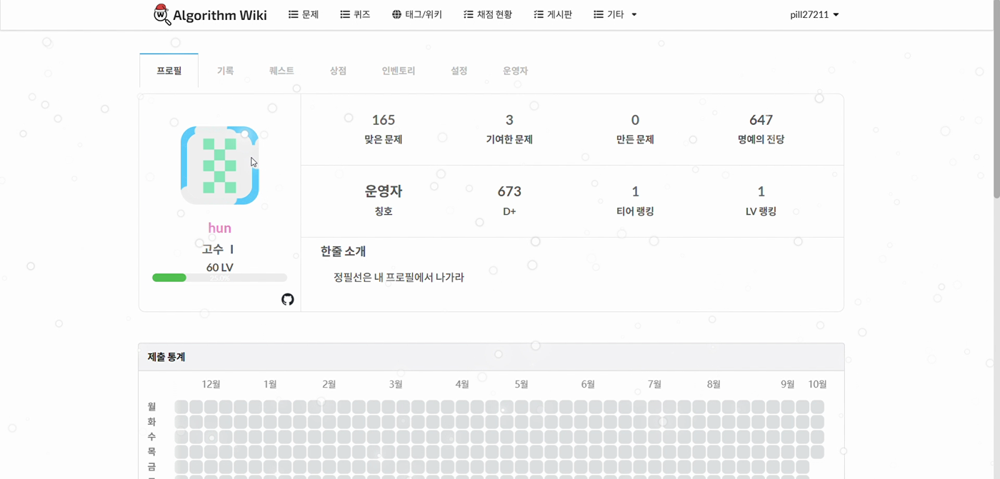

### 퀘스트 시스템
- **일일 / 주간 / 메인 / 히든** 4종 (`quest_api/ac_category/{daily,weekly,main,hidden}_quest.h`).
- 달성 판정 로직을 **C로 구현**해 채점 이벤트와 함께 평가, `cron`으로 일일·주간 리셋
  (`quest/scheduler/daily_scheduler`, `weekly_scheduler`).
- 진행도 임계값(`quest_end_prog`), 코인·경험치 보상, 뱃지 이미지 등 메타 관리.

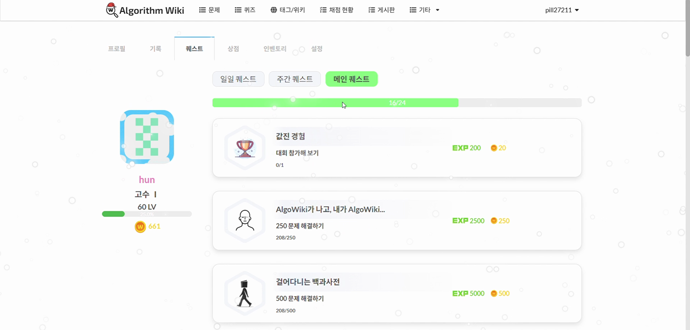

### 상점 & 인벤토리 & 아이템
- **상점(product)**: 가격·**레어도(rarity)**·타입을 가진 상품 카탈로그. `cron`으로 **매일 상품 라인업 로테이션**
  (`inventory/shop_scheduler/{daily,special}_scheduler`).
- **인벤토리(user_inventory)**: 유저별 보유 아이템·수량.
- **아이템**: 힌트 · 시간복잡도 힌트 · 럭키박스 · 닉네임/스트릭 색 변경 · 칭호 · **일일 퀘스트 리롤**
  (리롤은 난이도 티어별 **C++ 스크립트** `inventory/script/dquest_{beg,nor,adv,all,tag}_reload.cpp`).

  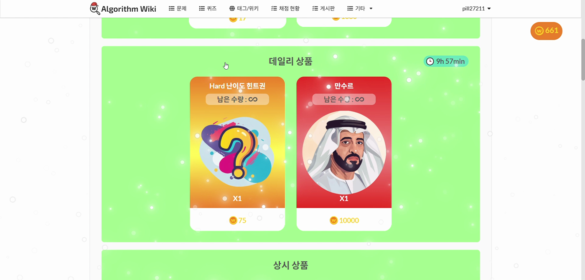
  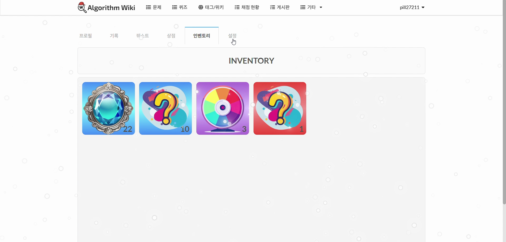

### 채점과 직접 연동되는 아이템 ⭐
- **힌트 / 시간복잡도 아이템**을 문제 채점 도메인과 연결 (`hint_item_use`, `time_item_use` — 누가·어떤 문제에 소비했는지 기록).
- 인벤토리의 아이템을 **문제 페이지에서 소비해 프리미엄 힌트를 잠금 해제**하는 구조.
  (문제 아카이브의 *💎 힌트 아이템* 섹션이 바로 이것)

  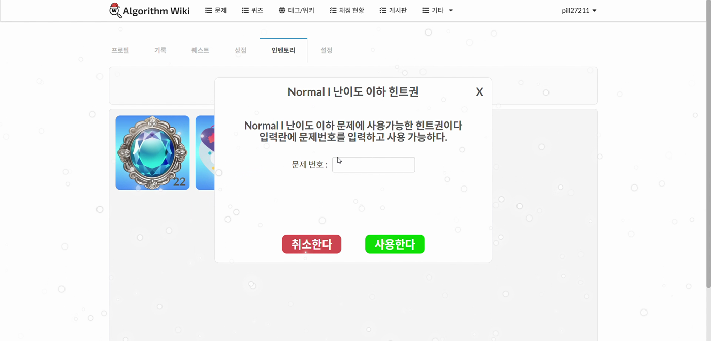
  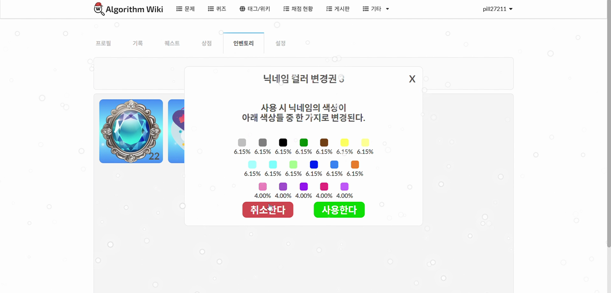

### 명예의 전당 (부문별 랭킹)
- 각 문제마다 **속도 · 메모리 · 코드 길이** 부문별 **상위 3인**을 포디움으로 전시.
- 정답 이후에도 **최적화 경쟁**을 유도하는 요소.

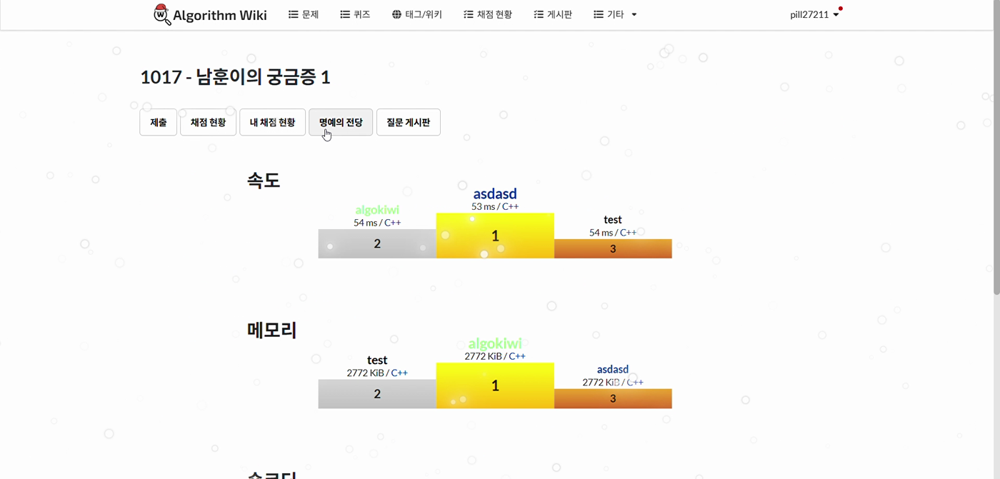

### 칭호 · 코스메틱 · 유저 마켓 · 복권
- **칭호(user_title) · 프로필 테두리(user_border)** 로 성취를 수집·전시.
- **유저 마켓**: `user_product_visibility`(재판매가·잔여수량) 기반 유저 간 아이템 재판매.
- **복권**: 주간 추첨을 **C++ 스케줄러**로 처리 (`lottery/lottery_scheduler.cpp`, 주 1회 cron).

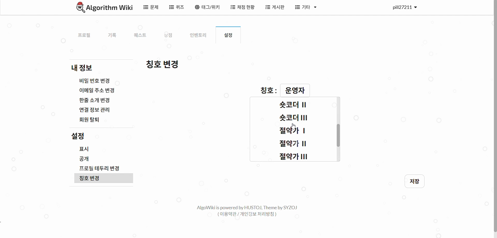

## 3. 아키텍처

성능·배치 성격의 로직(채점, 퀘스트 판정, 리롤, 스케줄러)은 **C/C++**,
웹·AJAX·데이터 접근은 **PHP**로 분리하고, 주기 작업은 **cron**으로 오케스트레이션했습니다.

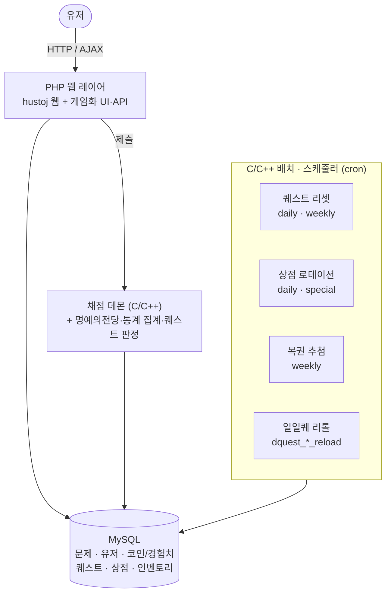

| 주기 | 작업 | 구현 |
|---|---|---|
| 매일 00:00 | 일일 퀘스트 리셋 | `quest/scheduler/daily_scheduler` |
| 매일 00:00 | 상점 라인업 로테이션 (일반·스페셜) | `inventory/shop_scheduler/{daily,special}_scheduler` |
| 매주 월 00:00 | 주간 퀘스트 리셋 | `quest/scheduler/weekly_scheduler` |
| 매주 월 00:00 | 복권 추첨 | `lottery/lottery_scheduler` |
| 채점 시(실시간) | 명예의 전당·통계 집계 | `judge_client` 연동 `update_stat.h` |

> 자세한 컴포넌트·데이터 모델은 [docs/architecture.md](docs/architecture.md) 참고.

> 🧑‍💻 **실제 소스**는 [`source/`](source/) 에서 확인할 수 있습니다.
> (채점 연동 · 크론 스케줄러 · 백엔드 API. hustoj 원본 코드·프론트엔드는 제외, GPL-2.0)

## 4. 플랫폼 둘러보기

| | |
|:---:|:---:|
| 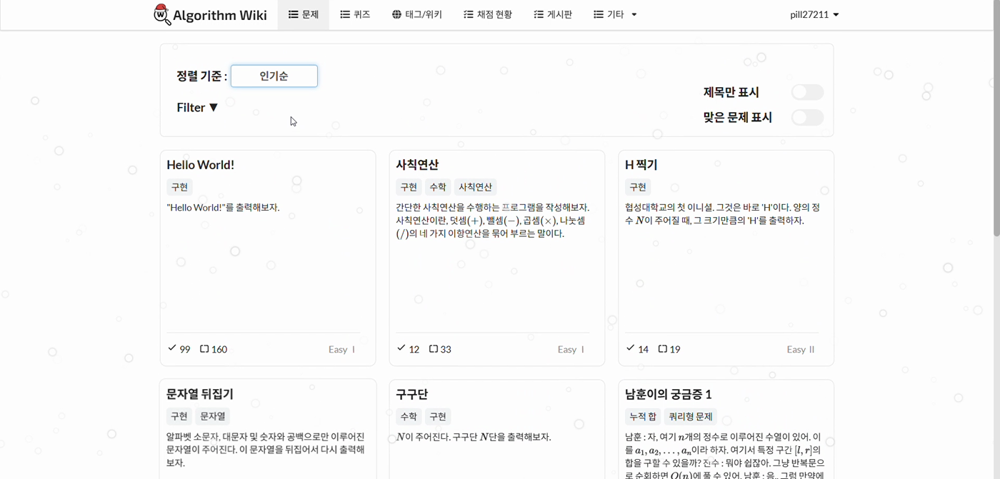 | 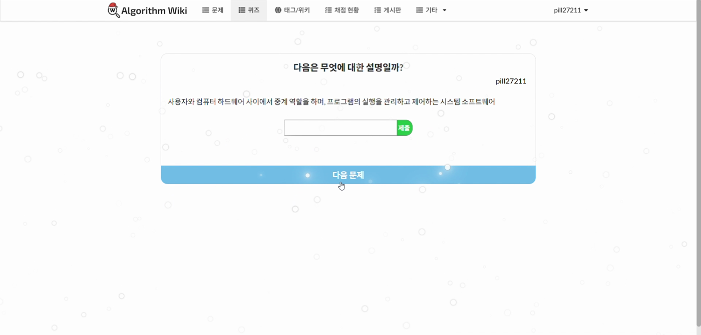 |
| **문제 목록** | **퀴즈** (개념 정의 맞히기) |
| 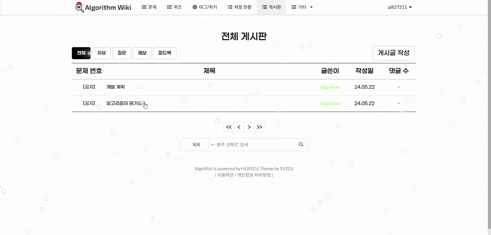 | 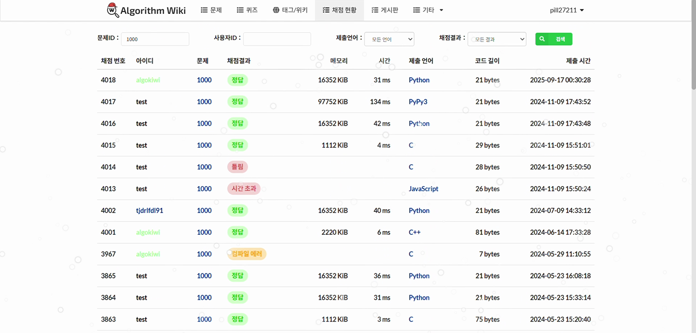 |
| **게시판** | **채점 현황** |

## 5. 기술 스택

- **언어**: C / C++ (채점·배치·스케줄러·퀘스트 판정), PHP (웹·AJAX·DB 접근)
- **DB**: MySQL
- **인프라**: Linux(AWS EC2), Nginx, `cron` 스케줄링
- **베이스**: hustoj (GPL) — 채점 파이프라인·문제/유저 도메인

## 6. 돌아본 점

- **잘한 것** — 채점기 위에 **독립적인 경제·성장 도메인**을 데이터 모델부터 설계해, 기존 hustoj 코드를
  최소 침습으로 확장했습니다. 성능 민감 로직을 C/C++ 배치로, 상호작용을 PHP로 분리한 것도 유효했습니다.
- **아쉬운 것** — 재화 밸런싱·어뷰징 방어(코인 인플레이션, 퀘스트 파밍)를 운영 데이터로 더 다듬지 못했습니다.
  아이템/퀘스트 판정이 채점 흐름과 강하게 결합돼, 테스트하기 쉬운 경계 설계가 부족했습니다.
- **배운 것** — "제품에 사람을 머무르게 하는 것"은 기능 수가 아니라 **루프(획득 → 소비 → 성취)의 설계**라는 점.

## 7. 관련 링크

- 🧩 **직접 출제한 문제 아카이브** — [algowiki-problems](https://github.com/pill27211/algowiki-problems) · [웹](https://pill27211.github.io/algowiki-problems/)
- 🛠 **베이스 OJ** — [hustoj](https://github.com/zhblue/hustoj) (GPL)

---

**© 2024–2026 정필선([@pill27211](https://github.com/pill27211)).**
이 저장소의 **글·다이어그램·스크린샷**에 대한 권리는 저에게 있으며, 무단 사용을 금합니다.
(기반 OJ 엔진은 [hustoj](https://github.com/zhblue/hustoj)(GPL)로, 이 저장소에는 포함되어 있지 않습니다.)

이 저장소는 AlgoWiki 프로젝트 개요와 제가 작성한 게임화 백엔드 소스([`source/`](source/)) 모음입니다. AlgoWiki는 팀 졸업작품이며, 위에 기술한 게임화 백엔드가 제 담당 영역입니다. 스크린샷은 운영 당시 데모 영상에서 추출했으며, 실제 운영 DB(사용자 개인정보 등)는 포함하지 않습니다.
