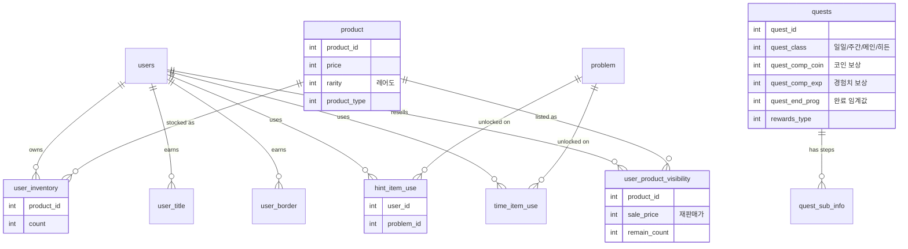
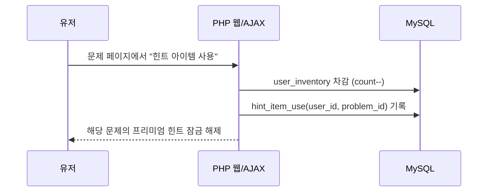
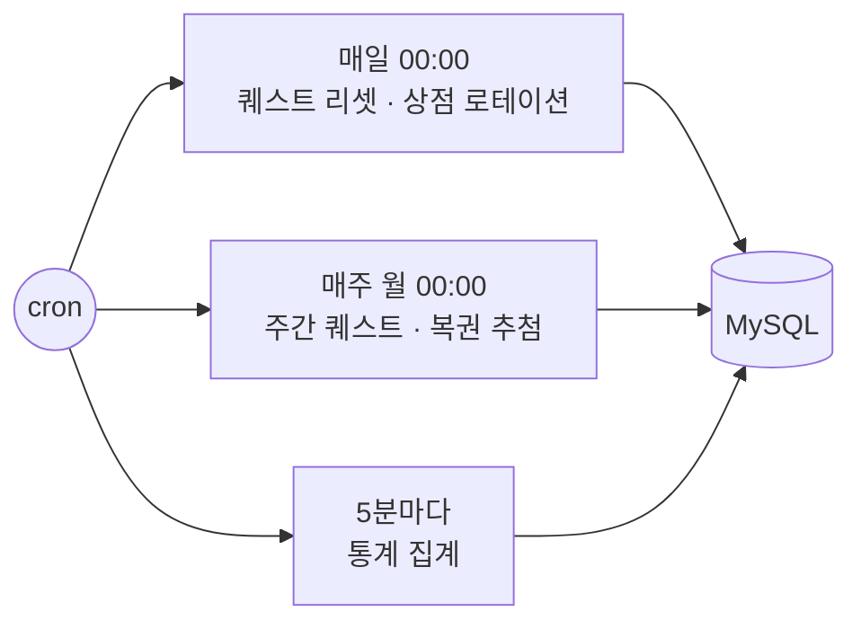

# AlgoWiki 아키텍처 노트

게임화 백엔드를 중심으로, 컴포넌트 구성과 데이터 모델·핵심 흐름을 정리합니다.
(기반 채점/문제/유저 도메인은 [hustoj](https://github.com/zhblue/hustoj) 구조를 따릅니다.)

## 컴포넌트

| 레이어 | 역할 | 구현 |
|---|---|---|
| **웹** | 페이지 렌더, 게임화 UI/AJAX, DB 접근 | PHP (`web/`, `web/quest`, `web/inventory`, `web/lottery`) |
| **채점 데몬** | 제출 코드 컴파일·실행·판정 | C/C++ (hustoj judge) |
| **배치/스케줄러** | 퀘스트 리셋·상점 로테이션·복권·리롤·통계 | C/C++ + `cron` |
| **DB** | 문제·유저·재화·퀘스트·상점·인벤토리 | MySQL |

## 게임화 데이터 모델

## 핵심 흐름 1 — 채점과 연동되는 아이템(힌트/시간복잡도)

인벤토리의 아이템이 **문제 채점 도메인과 직접 연결**되는 부분이 이 프로젝트의 특징입니다.

- `hint_item_use` / `time_item_use`는 "누가 · 어떤 문제에" 아이템을 소비했는지를 남겨,
  중복 소비 방지와 잠금 해제 상태 판정에 사용됩니다.
- 시간복잡도 아이템은 해당 문제의 **기대 시간복잡도 힌트**를 여는 별도 아이템입니다.

## 핵심 흐름 2 — 주기 작업(cron)

| 주기 | 작업 | 실행 파일 |
|---|---|---|
| 매일 00:00 | 일일 퀘스트 리셋 | `quest/scheduler/daily_scheduler` |
| 매일 00:00 | 상점 라인업 (일반) | `inventory/shop_scheduler/daily_scheduler` |
| 매일 00:00 | 상점 라인업 (스페셜) | `inventory/shop_scheduler/special_scheduler` |
| 매주 월 00:00 | 주간 퀘스트 리셋 | `quest/scheduler/weekly_scheduler` |
| 매주 월 00:00 | 복권 추첨 | `lottery/lottery_scheduler` |
| 5분마다 | 통계 집계 | `stat_scheduler` |

## 일일 퀘스트 리롤 (아이템 효과)

"일일 퀘스트 리롤" 아이템은 현재 일일 퀘스트를 새로 뽑아주는 기능으로,
난이도 티어별로 분리된 C++ 스크립트로 처리됩니다.

| 스크립트 | 대상 |
|---|---|
| `dquest_beg_reload` | 입문(beginner) |
| `dquest_nor_reload` | 일반(normal) |
| `dquest_adv_reload` | 고급(advanced) |
| `dquest_tag_reload` | 태그 지정 |
| `dquest_all_reload` | 전체 |
